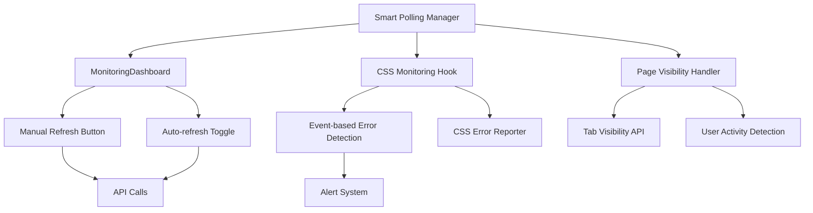

# Design Document

## Overview

This design addresses the optimization of API polling mechanisms in the ChemQuest application by implementing intelligent polling strategies, user-controlled refresh mechanisms, and event-driven updates. The solution focuses on reducing unnecessary network traffic while maintaining responsive user experience.

## Architecture

### Core Components

1. **Smart Polling Manager**: A centralized service that manages all polling operations with intelligent pause/resume capabilities
2. **User-Controlled Refresh System**: Manual refresh buttons and configurable auto-refresh settings
3. **Event-Driven CSS Monitoring**: Replace continuous polling with event-based error detection
4. **Page Visibility API Integration**: Automatic pause/resume based on tab visibility and user activity

### Component Interactions



## Components and Interfaces

### Smart Polling Manager

```typescript
interface PollingConfig {
  interval: number;
  enabled: boolean;
  pauseOnInactive: boolean;
  maxRetries: number;
}

interface PollingManager {
  register(id: string, callback: () => Promise<void>, config: PollingConfig): void;
  unregister(id: string): void;
  pause(id: string): void;
  resume(id: string): void;
  pauseAll(): void;
  resumeAll(): void;
  updateConfig(id: string, config: Partial<PollingConfig>): void;
}
```

### User-Controlled Refresh System

```typescript
interface RefreshControlProps {
  onRefresh: () => Promise<void>;
  autoRefreshEnabled: boolean;
  autoRefreshInterval: number;
  onAutoRefreshToggle: (enabled: boolean) => void;
  onIntervalChange: (interval: number) => void;
  loading: boolean;
  lastUpdated?: Date;
}

interface RefreshState {
  isRefreshing: boolean;
  autoRefreshEnabled: boolean;
  interval: number;
  lastRefresh: Date | null;
  error: string | null;
}
```

### Event-Driven CSS Monitoring

```typescript
interface CSSMonitoringEvents {
  'css-load-error': { url: string; error: Error };
  'css-load-success': { url: string };
  'css-parse-error': { url: string; error: Error };
}

interface EventDrivenCSSMonitor {
  startMonitoring(): void;
  stopMonitoring(): void;
  addEventListener<K extends keyof CSSMonitoringEvents>(
    type: K, 
    listener: (event: CSSMonitoringEvents[K]) => void
  ): void;
  removeEventListener<K extends keyof CSSMonitoringEvents>(
    type: K, 
    listener: (event: CSSMonitoringEvents[K]) => void
  ): void;
}
```

## Data Models

### Polling Registration

```typescript
interface PollingRegistration {
  id: string;
  callback: () => Promise<void>;
  config: PollingConfig;
  state: {
    active: boolean;
    paused: boolean;
    lastExecution: Date | null;
    nextExecution: Date | null;
    errorCount: number;
  };
  timer: NodeJS.Timeout | null;
}
```

### Refresh Control State

```typescript
interface RefreshControlState {
  componentId: string;
  autoRefreshEnabled: boolean;
  interval: number;
  isPaused: boolean;
  lastRefresh: Date | null;
  refreshCount: number;
  errorCount: number;
}
```

## Error Handling

### Polling Error Recovery

1. **Exponential Backoff**: Implement exponential backoff for failed polling attempts
2. **Circuit Breaker**: Stop polling after consecutive failures and require manual intervention
3. **Graceful Degradation**: Show cached data with clear indicators when polling fails
4. **User Notification**: Inform users when polling is paused due to errors

### CSS Monitoring Error Handling

1. **Event Aggregation**: Batch similar CSS errors to avoid alert spam
2. **Error Categorization**: Classify errors by severity and handle appropriately
3. **Automatic Recovery**: Attempt automatic CSS reload for transient failures
4. **Fallback Mechanisms**: Activate fallback CSS when critical stylesheets fail

## Testing Strategy

### Unit Tests

1. **Smart Polling Manager**: Test pause/resume, configuration updates, error handling
2. **Refresh Controls**: Test manual refresh, auto-refresh toggle, interval changes
3. **CSS Event Monitoring**: Test event emission, listener management, error detection
4. **Page Visibility Integration**: Test pause/resume on tab visibility changes

### Integration Tests

1. **End-to-End Polling**: Test complete polling lifecycle with real API calls
2. **User Interaction**: Test manual refresh and auto-refresh configuration
3. **Error Scenarios**: Test behavior during network failures and API errors
4. **Performance**: Measure reduction in API calls and network traffic

### Performance Tests

1. **Baseline Measurement**: Measure current API call frequency and network usage
2. **Optimization Verification**: Verify significant reduction in unnecessary calls
3. **User Experience**: Ensure responsive UI despite reduced polling frequency
4. **Resource Usage**: Monitor memory and CPU usage of polling mechanisms

## Implementation Phases

### Phase 1: Smart Polling Manager
- Create centralized polling management service
- Implement pause/resume functionality
- Add Page Visibility API integration

### Phase 2: MonitoringDashboard Optimization
- Replace automatic 30-second polling with user-controlled refresh
- Add manual refresh button and auto-refresh toggle
- Implement intelligent pause when tab is inactive

### Phase 3: CSS Monitoring Optimization
- Replace 5-second polling with event-driven monitoring
- Implement CSS load/error event listeners
- Add error aggregation and batching

### Phase 4: User Controls and Configuration
- Add user preferences for refresh intervals
- Implement refresh status indicators
- Add bandwidth-aware polling adjustments

## Performance Expectations

### API Call Reduction
- **MonitoringDashboard**: Reduce from continuous 30-second polling to on-demand refresh
- **CSS Monitoring**: Eliminate 5-second polling, use event-driven approach
- **Overall**: Expect 80-90% reduction in unnecessary API calls

### User Experience Improvements
- **Faster Initial Load**: Reduce startup API calls
- **Better Mobile Experience**: Respect data usage preferences
- **Responsive Interface**: Manual refresh provides immediate feedback
- **Clear Status**: Users know when data was last updated