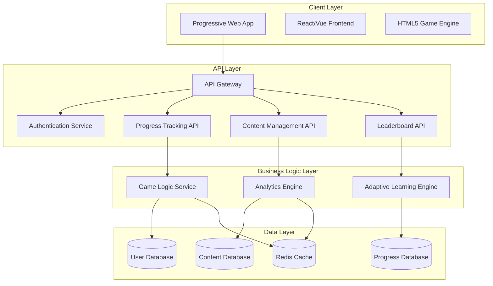

# Design Document

## Overview

ChemQuest: Alchemist Academy is designed as a progressive web application (PWA) that combines educational content management with engaging game mechanics. The system uses a modular architecture to support different learning realms while maintaining consistent progression tracking and user experience. The platform prioritizes accessibility, performance, and scalability to serve students across various devices and network conditions.

## Architecture

### High-Level Architecture



### Technology Stack

**Frontend:**
- React.js with TypeScript for component-based UI
- HTML5 Canvas for game animations and interactions
- CSS3 with Flexbox/Grid for responsive design
- Service Workers for offline capability
- Web Audio API for sound effects and feedback

**Backend:**
- Node.js with Express.js for API services
- PostgreSQL for relational data (users, progress, content)
- Redis for session management and real-time features
- JWT for authentication and authorization
- WebSocket for real-time multiplayer features

**Infrastructure:**
- Docker containers for microservices
- CDN for static assets and game resources
- Load balancer for scalability
- Monitoring and logging services

## Components and Interfaces

### Core Game Engine

The game engine manages the overall game state, progression, and realm transitions.

```typescript
interface GameEngine {
  // Character and progression management
  initializeCharacter(userId: string): Promise<Character>
  updateExperience(userId: string, xp: number): Promise<void>
  levelUp(userId: string): Promise<LevelUpResult>
  
  // Realm management
  unlockRealm(userId: string, realmId: string): Promise<void>
  getCurrentRealm(userId: string): Promise<Realm>
  
  // Challenge orchestration
  startChallenge(userId: string, challengeId: string): Promise<Challenge>
  submitAnswer(userId: string, challengeId: string, answer: Answer): Promise<Result>
  completeChallenge(userId: string, challengeId: string, score: number): Promise<Reward[]>
}

interface Character {
  id: string
  level: number
  experience: number
  gold: number
  health: number
  mana: number
  unlockedRealms: string[]
  inventory: InventoryItem[]
  achievements: Achievement[]
}
```

### Realm-Specific Components

Each realm implements a common interface while providing specialized game mechanics.

```typescript
interface RealmComponent {
  realmId: string
  name: string
  description: string
  requiredLevel: number
  
  // Challenge management
  getChallenges(): Challenge[]
  generateChallenge(difficulty: number): Challenge
  validateAnswer(challenge: Challenge, answer: Answer): ValidationResult
  calculateScore(challenge: Challenge, answer: Answer, timeElapsed: number): number
  
  // Realm-specific mechanics
  getSpecialMechanics(): RealmMechanic[]
  processBossChallenge(userId: string, bossId: string): Promise<BossResult>
}

// Example: Mathmage Trials Realm
class MathmageTrialsRealm implements RealmComponent {
  realmId = "mathmage-trials"
  name = "The Mathmage Trials"
  
  generateEquationDuel(difficulty: number): EquationChallenge {
    // Generate unbalanced chemical equations based on difficulty
  }
  
  generateMoleDungeon(userId: string): StoichiometryChallenge {
    // Create room escape stoichiometry puzzles
  }
  
  processBossChallenge(userId: string, bossId: "limiting-reagent-hydra"): Promise<BossResult> {
    // Multi-step reacting mass problems
  }
}
```

### Progress Tracking System

Comprehensive analytics and adaptive learning engine to personalize the experience.

```typescript
interface ProgressTracker {
  // Performance analytics
  recordAttempt(userId: string, challengeId: string, attempt: AttemptData): Promise<void>
  getPerformanceMetrics(userId: string): Promise<PerformanceMetrics>
  identifyWeakAreas(userId: string): Promise<WeakArea[]>
  
  // Adaptive difficulty
  calculateOptimalDifficulty(userId: string, challengeType: string): Promise<number>
  adjustDifficultyBasedOnPerformance(userId: string, performance: Performance): Promise<void>
  
  // Social features
  updateLeaderboard(userId: string, category: string, score: number): Promise<void>
  getFriendProgress(userId: string): Promise<FriendProgress[]>
}

interface PerformanceMetrics {
  overallAccuracy: number
  averageResponseTime: number
  strongestConcepts: string[]
  weakestConcepts: string[]
  learningVelocity: number
  streakData: StreakData
}
```

### Content Management System

Flexible content system to support curriculum updates and customization.

```typescript
interface ContentManager {
  // Challenge content
  getChallenge(challengeId: string): Promise<Challenge>
  createChallenge(challenge: ChallengeTemplate): Promise<string>
  updateChallenge(challengeId: string, updates: Partial<Challenge>): Promise<void>
  
  // Educational resources
  getExplanation(conceptId: string): Promise<Explanation>
  getAnimatedMnemonic(conceptId: string): Promise<AnimatedContent>
  getFormulaReference(category: string): Promise<FormulaSheet>
  
  // Curriculum mapping
  mapToCurriculum(challengeId: string, curriculumStandards: string[]): Promise<void>
  getChallengesByCurriculum(curriculum: string): Promise<Challenge[]>
}
```

## Data Models

### User and Character Data

```typescript
interface User {
  id: string
  email: string
  username: string
  createdAt: Date
  lastLoginAt: Date
  preferences: UserPreferences
  character: Character
}

interface UserPreferences {
  soundEnabled: boolean
  animationsEnabled: boolean
  difficultyPreference: 'adaptive' | 'manual'
  accessibilityOptions: AccessibilityOptions
}

interface Character {
  id: string
  userId: string
  level: number
  experience: number
  gold: number
  health: number
  mana: number
  unlockedRealms: RealmUnlock[]
  inventory: InventoryItem[]
  achievements: Achievement[]
  statistics: CharacterStatistics
}
```

### Challenge and Content Data

```typescript
interface Challenge {
  id: string
  realmId: string
  type: ChallengeType
  difficulty: number
  title: string
  description: string
  content: ChallengeContent
  timeLimit?: number
  requiredLevel: number
  rewards: Reward[]
  metadata: ChallengeMetadata
}

interface ChallengeContent {
  question: string
  options?: string[]
  correctAnswer: string | string[]
  explanation: string
  hints: string[]
  visualAids?: VisualAid[]
}

interface VisualAid {
  type: 'image' | 'animation' | 'diagram' | 'molecular_structure'
  url: string
  altText: string
  interactive?: boolean
}
```

### Progress and Analytics Data

```typescript
interface AttemptData {
  challengeId: string
  userId: string
  startTime: Date
  endTime: Date
  answer: string | string[]
  isCorrect: boolean
  score: number
  hintsUsed: number
  timeElapsed: number
  metadata: AttemptMetadata
}

interface LearningSession {
  id: string
  userId: string
  startTime: Date
  endTime: Date
  challengesAttempted: string[]
  totalScore: number
  experienceGained: number
  conceptsReinforced: string[]
  newConceptsLearned: string[]
}
```

## Error Handling

### Client-Side Error Handling

```typescript
class GameErrorHandler {
  // Network connectivity issues
  handleOfflineMode(): void {
    // Enable offline practice mode with cached content
    // Queue progress updates for when connection returns
  }
  
  // Challenge loading failures
  handleChallengeLoadError(challengeId: string): void {
    // Fallback to cached challenges
    // Provide user-friendly error message
    // Log error for debugging
  }
  
  // Invalid user input
  handleInvalidInput(input: string, expectedFormat: string): void {
    // Provide immediate feedback
    // Suggest correct format
    // Don't penalize for format errors
  }
}
```

### Server-Side Error Handling

```typescript
class APIErrorHandler {
  // Database connection issues
  handleDatabaseError(error: DatabaseError): APIResponse {
    // Implement circuit breaker pattern
    // Return cached data when possible
    // Graceful degradation of features
  }
  
  // Authentication failures
  handleAuthError(error: AuthError): APIResponse {
    // Clear invalid tokens
    // Redirect to login
    // Preserve game state for recovery
  }
  
  // Rate limiting
  handleRateLimit(userId: string): APIResponse {
    // Implement exponential backoff
    // Provide clear feedback to user
    // Suggest optimal usage patterns
  }
}
```

## Testing Strategy

### Unit Testing

- **Component Testing**: Test individual React components with Jest and React Testing Library
- **Game Logic Testing**: Comprehensive test coverage for challenge generation, scoring, and progression algorithms
- **API Testing**: Test all endpoints with various input scenarios and edge cases
- **Database Testing**: Test data models, relationships, and query performance

### Integration Testing

- **Realm Integration**: Test complete user flows through each realm's challenges
- **Progress Tracking**: Verify accurate XP calculation, level progression, and achievement unlocking
- **Real-time Features**: Test leaderboard updates and multiplayer challenge features
- **Cross-Platform**: Test functionality across different browsers and devices

### Performance Testing

- **Load Testing**: Simulate concurrent users to test scalability
- **Response Time**: Ensure challenge loading and submission stay under 200ms
- **Memory Usage**: Monitor client-side memory consumption during extended play sessions
- **Network Optimization**: Test performance under various network conditions

### User Experience Testing

- **Accessibility Testing**: Verify screen reader compatibility and keyboard navigation
- **Usability Testing**: Test with actual chemistry students to validate learning effectiveness
- **A/B Testing**: Compare different game mechanics and UI approaches
- **Educational Effectiveness**: Measure learning outcomes compared to traditional methods

### Automated Testing Pipeline

```yaml
# CI/CD Pipeline Testing Stages
stages:
  - unit_tests:
      - frontend_components
      - backend_services
      - game_logic
  
  - integration_tests:
      - api_endpoints
      - database_operations
      - realm_workflows
  
  - performance_tests:
      - load_testing
      - response_times
      - memory_profiling
  
  - deployment_tests:
      - staging_validation
      - production_smoke_tests
      - rollback_procedures
```

This design provides a robust, scalable foundation for the ChemQuest: Alchemist Academy platform while maintaining the engaging game mechanics you envisioned. The modular architecture allows for easy expansion of realms and challenges, while the comprehensive testing strategy ensures reliability and educational effectiveness.